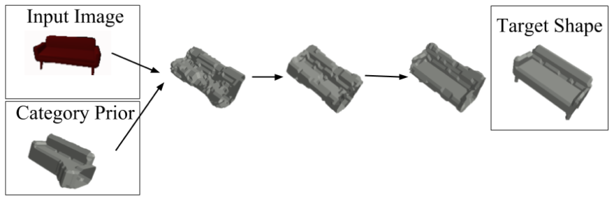

# **Single-view-3D-Reconstruction-Supported-by-Classification**

This is the repository for our final project on the course "Machine Learning for 3D Geometry" at TUM. The repository contains two branches: the "main" for our network and the "baseline" for Wallace's work in 2019.

Plase read the `report.pdf` for more details.

## Desciption

### Baseline mothed

*Bram Wallace and Bharath Hariharan. Few-shot generalization for single-image 3d reconstruction via priors. In Proceedings of the IEEE/CVF International Conference on Computer Vision, pages 3818–3827, 2019.

- The baseline method modifes a shape prior iteratrively to reconstruct the shape in the input image
- Averaged shape for global features; Single-view image for refining the averaged shapes
- Probem: Same global embedding for all shapes in the same category; the performance relies on the quality of the prior shape

### Our method

- Protential improvement: Extract the global features from the same image, instead of from a shape prior acquired by averaging shapes
- Multi-task learning helps the network find meaningful features
  - Classification Task helps the network learn global features based on the categorical information
  - Reconstruction Task force the network focus on local features

## Performance

We evaluated the baseline methods and our mothods on the ShapeNet dataset. 

* ShapeNet rendered images [http://cvgl.stanford.edu/data2/ShapeNetRendering.tgz](http://cvgl.stanford.edu/data2/ShapeNetRendering.tgz)
* ShapeNet voxelized models [http://cvgl.stanford.edu/data2/ShapeNetVox32.tgz](http://cvgl.stanford.edu/data2/ShapeNetVox32.tgz)

The baseline mothed is only tested on 7 classes in the baseline paper. Therefore, we evaluated it again on 7 and 13 classes. we calculated Intersection over Union (IoU) values as performance measurement.

|                    | 7 classes                                | 13 classes             |
| ------------------ | ---------------------------------------- | ---------------------- |
| **Baseline** | 0.63 (paper) 0.56 (our replication) | 0.50 (our replication) |
| **Proposed** | 0.627                                    | 0.620                  |

## Folder Structures

- `utils`: utility function files.
- `data`: dataset class for ShapeNet for our tasks.
- `model`: the network that we have for the dataset.
- `runs`: the log files produced during experiments. Open it with the TensorBoard.
- `configs`: specify path to dataset and logs when executing on different machines.

## Important Files

- `main.py`: set up the main parameters and the code for testing model
